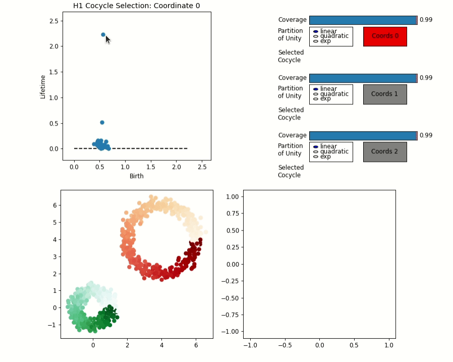
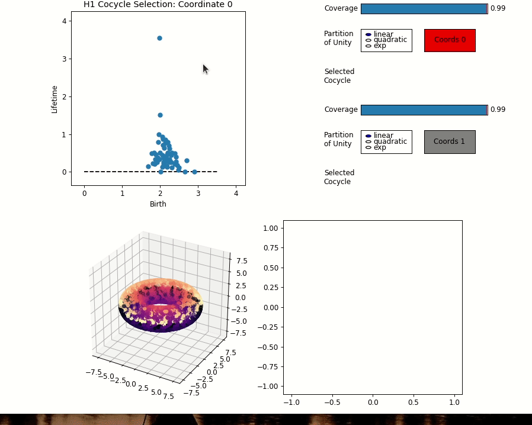

# DREiMac
## Dimension Reduction with Eilenberg-MacLane Coordinates

### Chris Tralie, Tom Mease, Jose Perea

# Python version

Code can be found in dreimac/.  If you're using conda and would like to create a virtual environment first, type
~~~~~ bash
conda create -n dreimac python=3.6
conda activate dreimac
~~~~~

Then, to install, type
~~~~~ bash
git clone https://github.com/ctralie/DREiMac.git
cd DREiMac
pip install cython
pip install -e .
~~~~~

Then, you can import dreimac from any python file or notebook.  For example, if you type the following from the root of the repository
~~~~~ bash
cd notebooks
jupyter notebook
~~~~~

then you will be able to interactively explore the notebooks we have setup

## Two Circles Example

Below is an example showing the interactive circular coordinates interface on a data set comprised of two noisy circles in 2D

## Torus Example

Below is an example showing the interactive circular coordinates interface on a 3D point cloud of a torus

# Javascript version

Code can be found in dreimacjs/
CircluarCoords.html and ripser.html are the entry points

## Emscripten Compile options

~~~~~ bash
emcc --bind -s ALLOW_MEMORY_GROWTH=1 -O3 ripser.cpp
~~~~~

## MIME Types
* MIME Types for Javascript files should be text/javascript
* MIME Types for wasm files should be application/wasm
